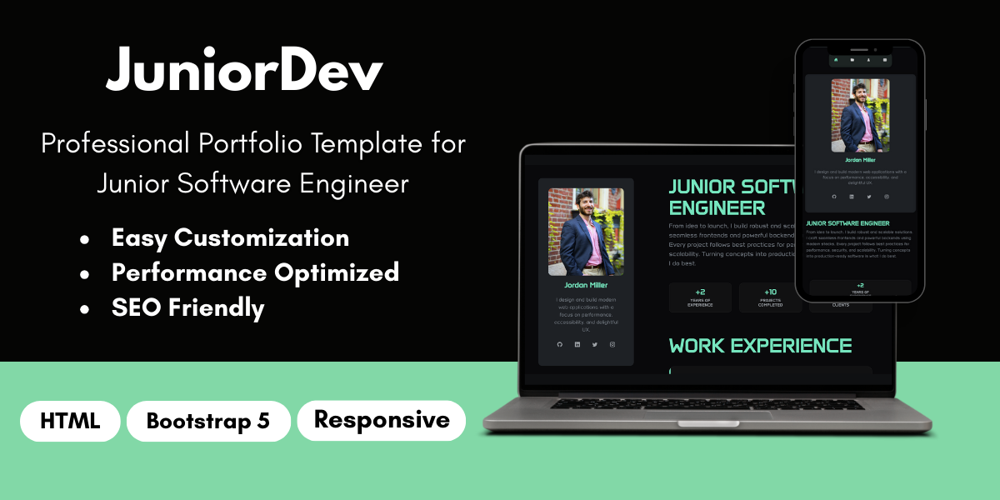

# 🚀 Professional Developer Portfolio Template

<div align="center">


**A stunning, modern, and fully responsive developer portfolio template that will make you stand out from the crowd!**

[](https://juniordev.aureathemes.com/)
[](https://aureathemes.com/templates/juniordev/)
[](https://github.com/MrSky099/free-html-developer-portfolio-template.git)
[](https://github.com/MrSky099/free-html-developer-portfolio-template.git)

</div>

---

## 📸 Template Preview

<div align="center">



</div>

---

## ✨ Why Choose This Template?

### 🎯 **Perfect for Job Applications**
- **Professional Design**: Clean, modern layout that impresses recruiters
- **Mobile-First**: Responsive design that looks great on all devices
- **Fast Loading**: Optimized for performance and SEO
- **Easy to Customize**: Simple HTML/CSS structure for quick modifications

### 🚀 **Stand Out Features**
- **Animated Skill Bars**: Interactive progress bars that animate on scroll
- **Smooth Animations**: Elegant reveal animations and hover effects
- **Modern Typography**: Beautiful Google Fonts (Anta & DM Sans)
- **Dark Theme**: Professional dark color scheme with accent colors
- **Contact Form**: Ready-to-use contact section
- **Social Links**: Integrated social media icons

### 💼 **Complete Sections**
- ✅ **Hero Section** with compelling headline and stats
- ✅ **Work Experience** timeline with company details
- ✅ **Skills** with animated progress bars
- ✅ **Projects** showcase with hover effects
- ✅ **Education** timeline
- ✅ **Certificates** grid layout
- ✅ **Contact Form** for potential employers

---

## 🛠️ Tech Stack

| Technology | Purpose | Version |
|------------|---------|---------|
| **HTML5** | Structure & Semantics | Latest |
| **CSS3** | Styling & Animations | Latest |
| **JavaScript** | Interactions & Animations | ES6+ |
| **Bootstrap 5** | Responsive Framework | 5.3.8 |
| **Bootstrap Icons** | Icon Library | 1.11.1 |
| **Google Fonts** | Typography | Anta, DM Sans |

---

## 🚀 Quick Start

### Option 1: Direct Download
1. **Download** the template files
2. **Open** `index.html` in your browser
3. **Customize** with your information
4. **Deploy** to your preferred hosting platform

### Option 2: Local Development
```bash
# Clone the repository
git clone https://github.com/MrSky099/free-html-developer-portfolio-template.git

# Navigate to the directory
cd free-html-developer-portfolio-template

# Serve locally (Python 3)
python -m http.server 5500

# Or with Node.js
npx serve . -l 5500 --single

# Open in browser
open http://localhost:5500
```

---

## 🎨 Customization Guide

### 1. **Personal Information**
Edit the following in `index.html`:
- Name and title
- Bio and description
- Social media links
- Contact information

### 2. **Content Sections**
- **Work Experience**: Update company names, positions, and descriptions
- **Skills**: Modify skill names and proficiency percentages
- **Projects**: Add your projects with descriptions and tech stacks
- **Education**: Update your educational background
- **Certificates**: Add your certifications and achievements

### 3. **Styling**
Customize in `style.css`:
- Color scheme (CSS variables)
- Typography settings
- Spacing and layout
- Animation timings

### 4. **Images**
Replace in `images/` folder:
- `developer-profile.webp` - Your professional photo
- `favicon.svg` - Your personal favicon

---

## 🌐 Deployment Options

### **Vercel** (Recommended)
1. Import your Git repository
2. Framework: **Other**
3. Build Command: *(leave empty)*
4. Output Directory: `/`
5. Deploy! 🚀

### **Netlify**
1. Connect your Git repository
2. Build command: *(leave empty)*
3. Publish directory: `/`
4. Deploy! 🚀

### **GitHub Pages**
1. Enable Pages in repository settings
2. Source: Deploy from a branch
3. Branch: `main`
4. Save! 🚀

---

## 📱 Browser Support

| Browser | Support |
|---------|---------|
| Chrome | ✅ Full Support |
| Firefox | ✅ Full Support |
| Safari | ✅ Full Support |
| Edge | ✅ Full Support |
| Mobile Browsers | ✅ Full Support |

---

## 🏆 Success Stories

> *"This template helped me land my dream job! The professional design and smooth animations really impressed the hiring manager."* - **Sarah M., Frontend Developer**

> *"Perfect for junior developers. Easy to customize and looks incredibly professional."* - **Alex K., Full Stack Developer**

---

## 🎯 More Professional Templates

Looking for more templates to boost your career? Visit our main website for a complete collection of professional templates:

### 🌟 **[AureaThemes.com](https://aureathemes.com)** 🌟

**Discover our premium collection of:**
- 🎨 **Portfolio Templates** - Stand out with unique designs
- 💼 **Resume Templates** - Professional CV layouts
- 🏢 **Business Templates** - Corporate website designs
- 📱 **Landing Pages** - High-converting page templates
- 🛍️ **E-commerce Templates** - Complete online store designs

**Why choose AureaThemes?**
- ✅ **Professional Quality** - Industry-standard designs
- ✅ **Mobile Responsive** - Perfect on all devices
- ✅ **SEO Optimized** - Better search engine rankings
- ✅ **Fast Loading** - Optimized for performance
- ✅ **Easy Customization** - No coding skills required
- ✅ **Regular Updates** - Always up-to-date with latest trends

**Get hired faster with our professional templates!** 🚀

---

## 📊 Template Statistics


---

## 📄 License

This project is licensed under the **MIT License** - see the [LICENSE](LICENSE) file for details.

---

## 🙏 Acknowledgments

- **Bootstrap 5** for the responsive framework
- **Bootstrap Icons** for the beautiful icon set
- **Google Fonts** for the typography (Anta & DM Sans)
- **All contributors** who help improve this template

---

## 📞 Support

Need help? Have questions? We're here to help!

- 📧 **Email**: support@aureathemes.com
- 🐛 **Issues**: [Report bugs](https://github.com/MrSky099/free-html-developer-portfolio-template/issues)
- 💡 **Suggestions**: [Request features](https://github.com/MrSky099/free-html-developer-portfolio-template/issues)

---

<div align="center">

### ⭐ **Star this repository if you found it helpful!** ⭐

**Made with ❤️ by [aureathemes](https://aureathemes.com)**

[](https://github.com/MrSky099)
[](https://aureathemes.com)
[](https://x.com/aureathemes_/)

</div>